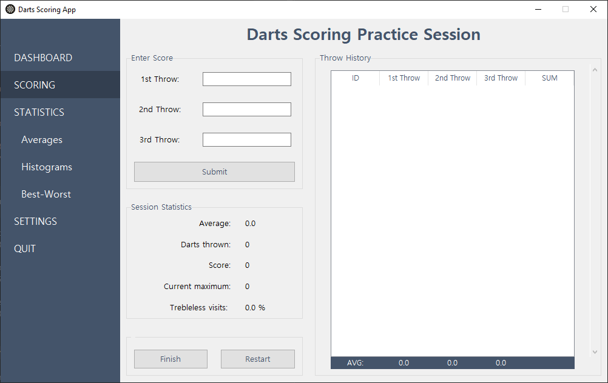
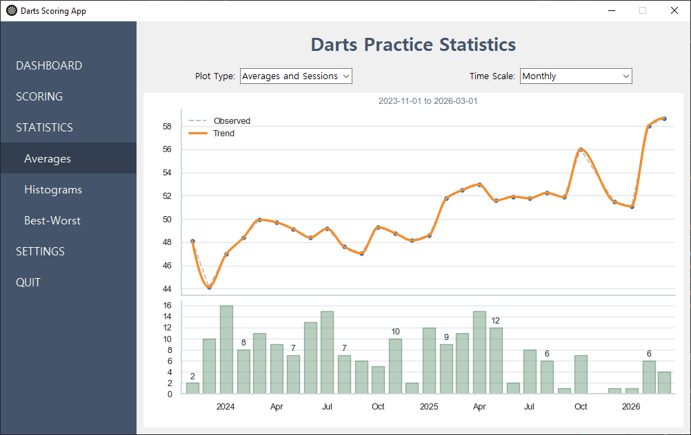

# DartsApp

Darts scoring application that enables tracking each throw individually and evaluating the scoring performance using detailed statistics and visualizations for each throw.

## Motivation
The main points that shaped the development of this application:

1. To have a database that **`stores each throw`**, not just the final score.
2. To include **`detailed statistics`**, not only common metrics like the 3-dart-average, number of 180s etc., but also **`metrics for each dart`**,allowing users to detect faulty trends in their throw (for example, if the 3rd dart tends to achieve lower scores).
3. To have the **`possibilty to implement all kinds of further analytics`** driven by curiosity
4. To retain **`all data`** without being limited by any time scale (for example, data shown for the last 12 months only)

## App Uers Interface

