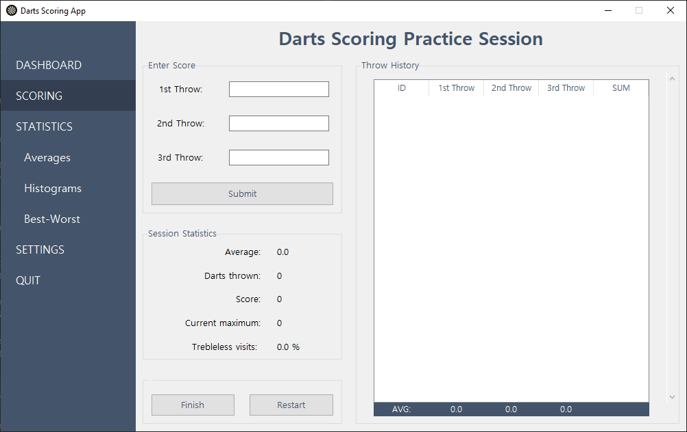
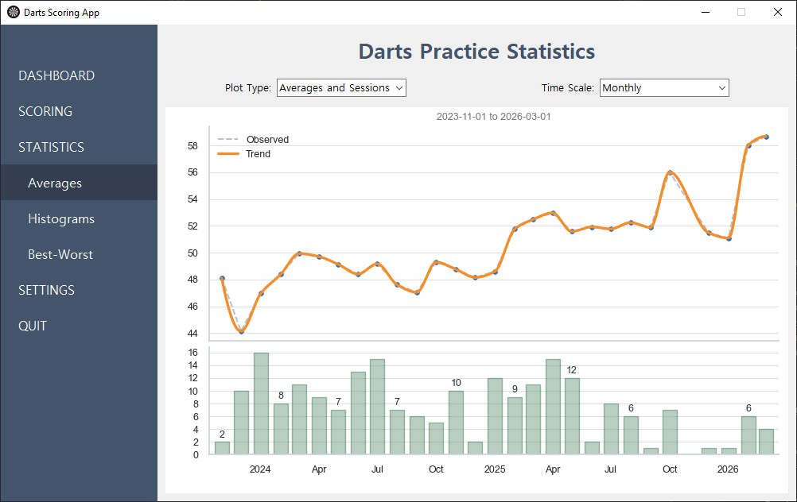

# DartsApp

DartsApp is a desktop Tkinter application for logging darts practice sessions throw by throw. Instead of storing only final scores, it keeps each visit in a local SQLite database and uses that history to show session stats, historical charts, and best or worst performance windows over time.

## Features

- Record every throw of a scoring practice session.
- Edit recorded throws directly in the throw history table.
- View live session statistics such as average, darts thrown, max visit, and trebleless visit ratio.
- Explore historical plots for averages, sessions played, darts thrown, 180s/171s, and trebleless visits.
- Analyze best and worst rolling performance over a selected date range.
- Configure automatic database backups from the settings page.

## Screenshots

Main scoring workflow:



Statistics and analysis views:



## Requirements

- Python 3.12 or newer
- `tkinter` available in your Python installation

The third-party Python dependencies are listed in both `requirements.txt` and `pyproject.toml`.

## Installation

Clone the repository, then create and activate a virtual environment.

```bash
python -m venv .venv
.venv\Scripts\activate
```

Install dependencies using either of the supported approaches:

With `requirements.txt`:

```bash
pip install -r requirements.txt
```

With `pyproject.toml`:

```bash
pip install .
```

## Running the App

From the project root, you can start the application directly with:

```bash
python darts_app.py
```

If you installed the project with `pip install .`, you can also use the generated launcher command:

```bash
darts-app
```

## Data and Backups

- The application stores its SQLite database in `db/darts_data.db`.
- Database tables are initialized automatically when the app starts.
- Backup files are written to the folder configured in `config.ini`.
- If no custom backup path is configured, the app falls back to `db/backups`.
- Each backup file includes a timestamp in its filename.

## Current Status

The app already covers the core scoring, statistics, and backup workflow. Some areas are still intentionally simple, such as the dashboard page, while the analytics side is designed to grow over time.

## Roadmap Ideas

- Add more practice modes beyond scoring sessions.
- Expand the dashboard with summary widgets and recent-session highlights.
- Introduce more advanced analytics built on the stored throw-level data.
