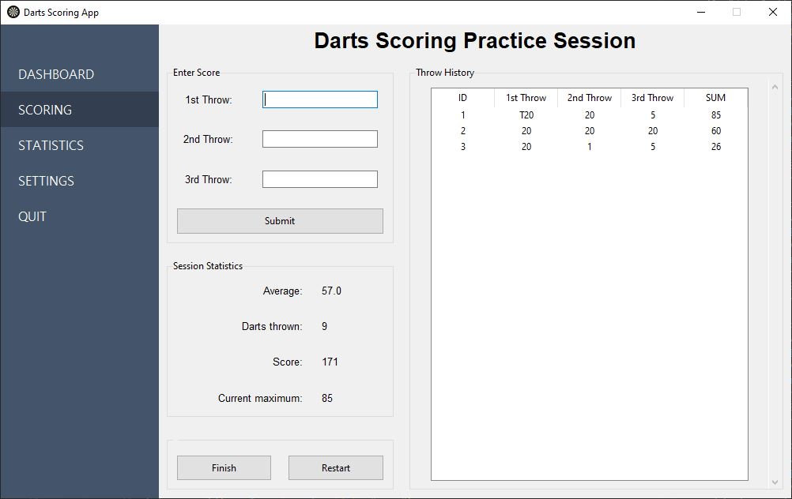
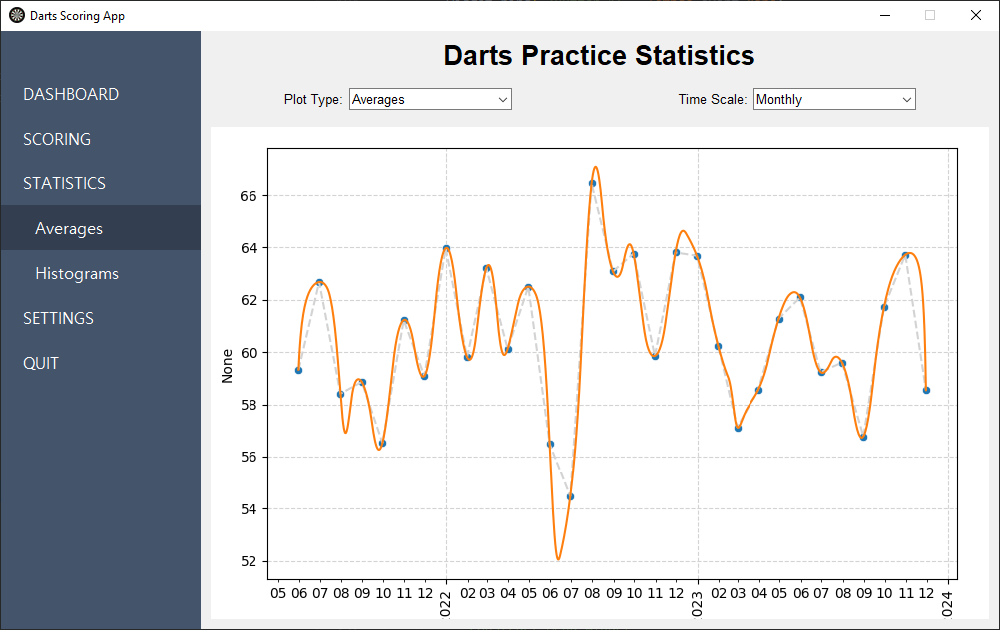

# DartsApp

A small tkinter application for darts, with which the scoring practice session can be tracked.

## About
This is an ongoing pet project, where the focus is on learning the language and programming concepts while building an application for a portfolio. Feel free to get in touch, should you have any advices or find any issues. 

## App interface

